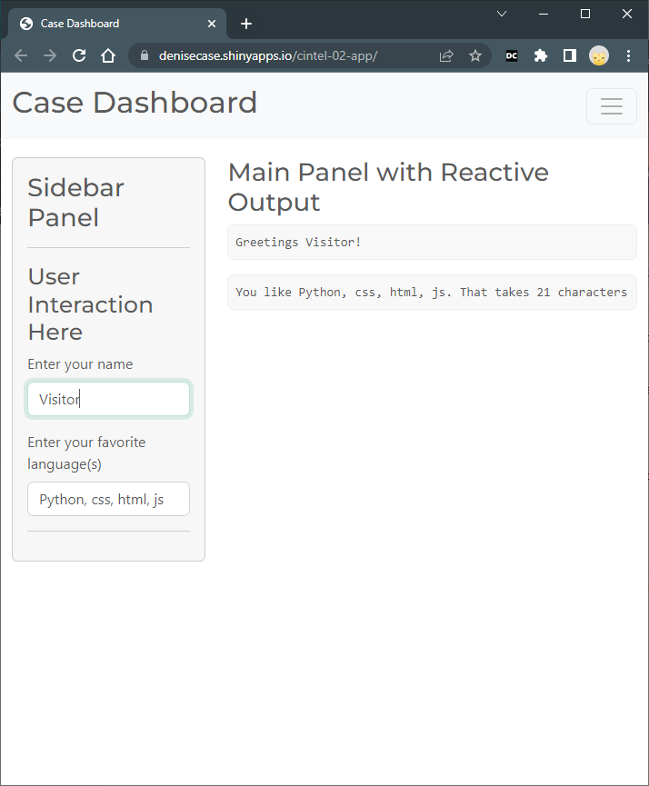

# Continuous Intelligence and Interactive Analytics - Initial App

- Interactive app: [cintel-02-app](https://denisecase.shinyapps.io/cintel-02-app/)
- Repository: [cintel-02-app](https://github.com/denisecase/cintel-02-app)
- Author: [Denise Case](https://github.com/denisecase)

In this module, we add another important tool: Python. 
If you are new to Python, don't worry, it's relatively easy to learn and very powerful.

🚀 Rocket Tips are for learners who want to go beyond the basics. 
They are not required but can improve workflow, increase productivity, and make things more enjoyable.

-----

## Sign Up for shinyapps.io (Free Account)

Sign up for a free account on shinyapps.io. 
You can sign in via GitHub for convenience.

## Copy This Repository

Copy this starter repository into your own GitHub account by clicking the 'Fork' button at the top of this page. 

-----

## Set Up Your Machine

### Install Python

1. Download and install Python 3 from the [official Python website](https://www.python.org/). Don't forget to add Python to your PATH during installation.

-----

## Customize Your Web App

### Get the Code to your Local Machine
    
1. Open VS Code and from the menu, select **View** / **Command Palette**.
1. Type "Git: Clone" in the command palette and select it.
1. Enter the URL (web address) of your forked GitHub repository (make sure it contains your GitHub username - not denisecase).
1. Choose a directory on your local machine (e.g., Documents folder) to store the project.
1. If prompted, sign in to GitHub from VS Code.

### Make Changes in VS Code

With your repository folder open in VS Code:

1. Click on this README.md file for editing.
1. Update the README.md file by changing your name in the author link above.
1. Update the links in the README.md file to your username instead of denisecase.

### Save Your Changes

1. After making changes, send them back up to GitHub.
1. In VS Code, find the "Source Control" icon and click it.
1. Important: Enter a brief commit message describing your changes.
1. Change the "Commit" button dropdown to "Commit and Push" to send your changes back to GitHub.

-----

## Shiny For Python

With the advent of WASM (Web Assembly), it is now possible to run Python in the browser.
We can write the logic for our interactive apps using Python instead of JavaScript.

Shiny is the most popular interactive web app framework for R (another popular data science language) and recently became available for Python. 

To get started, read [SHINY.md](SHINY.md). 

To learn more about how it compares to other popular options, check out this 16 min video on [YouTube](https://www.youtube.com/watch?v=LDd2ao5KjKM).

## Interactive App

With Shiny for Python, we can create interactive apps with Python.

