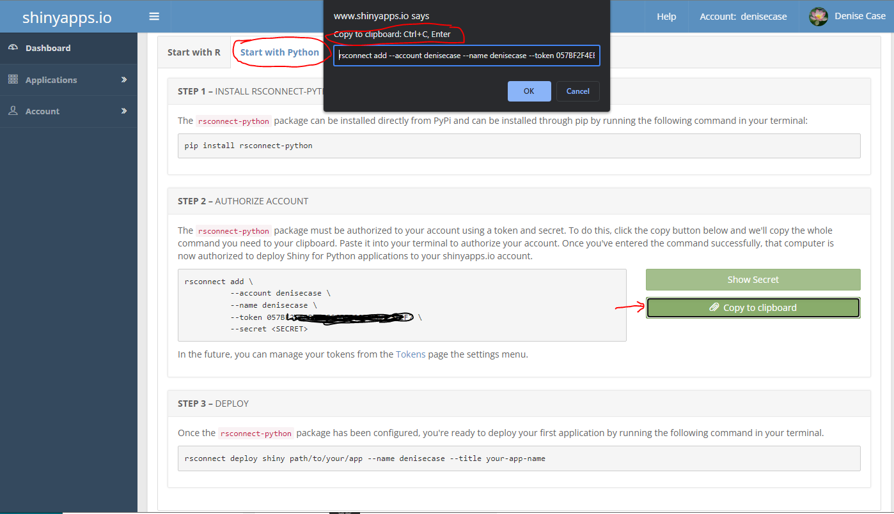

# Getting Started with Shiny for Python

If you used VS Code to clone your repository/repo, it may still be open to this repo folder.
If not, open VS Code and open the folder containing your repo.

In VS Code, use Terminal / New Terminal to open a terminal window.
Use PowerShell on Windows, Terminal on Mac/Linux.
Type the following command in the terminal and hit Enter to run it. 

Earlier, you installed Python and verified it with:

```shell
python --version
```

If that didn't work, try `python3 --version` or `py --version`. 
Use the command that works instead of `python` in the following instructions. 

🚀 Rocket Tip: Modify this README.md file to reflect the commands that work on your machine. 

## Install and Upgrade Python Tools Globally

Install some additional content into your global Python for best results. 
open your terminal (PowerShell on Windows, Terminal on Mac/Linux) and
install these to your default Python using the commands below. 
Wait for each command to finish before running the next one.
We use `rsconnect-python` to deploy our app to shinyapps.io later.

```shell
python -m pip install --upgrade pip wheel
python -m pip install --upgrade black ruff pyright
python -m pip install --upgrade git+https://github.com/rstudio/rsconnect-python.git
```

You must have reconnect-python installed for the next step.

## Authorize shinyapps.io

Shiny offers a free service for hosting Shiny apps. It's pretty easy to use.
Using a web browser (I use Chrome), sign in to your free shinyapps.io account.
For convenience, I sign in using GitHub.

1. On the Getting Started page, click on the "Start with Python" tab. 
1. Click "Show Secret"
1. Click "Copy to Clipboard". Follow the instructions. Mine said
1. Hit Ctrl c / ENTER to copy the provided command to the clipboard. 
1. Open a terminal window. (Terminal on Mac/Linux, PowerShell on Windows).
1. Click in the terminal window to paste the command and hit ENTER to run it.



## Create a Virtual Environment

Back in VS Code, create a virtual environment to hold the packages we need 
just for this project. If it works correctly, you should see a new folder named .venv.
The leading dot is typically used for items hidden by default.
As an analyst and dashboard developer, be sure you can see hidden folders and files on your machine. 
In the VS Code Terminal, run the following command:

```shell
python -m venv .venv
```

When VS Code asks if it should create the virtual environment, click yes.

🚀 Rocket Tip: Read VS Code suggestions, they are often very good. Consider using them. 

## Activate the Virtual Environment

Activate the virtual environment just created. 
After activating it, notice how the prompt changes to show the active virtual environment (.venv). 

- On Windows: `.venv\Scripts\activate`
- On macOS/Linux: `source .venv/bin/`

## Install Libraries into Virtual Environment

Install current libraries used in this project into our virtual environment.

```shell
python -m pip install --upgrade pip wheel 
python -m pip install --upgrade -r requirements.txt
```

It may take a while. It's relatively complex to deal with Python environments,
but these are common activities for analysts, and we'll do them often enough, 
it'll become somewhat routine.  

## Run the App

Verify your virtual environment is **activated**, 
then run the app with the following command:

```shell
shiny run --reload app.py
```

Open the app by following the instructions provided in the terminal. 
For example, try CTRL CLICK (hit both at the same time) on the URL displayed (http://127.0.0.1:8000).

Hit CTRL c (at the same time) to quit the app. 
If it won't stop, close the terminal window.
Reopen the terminal window and be sure the virtual environment is activated
before running the app again.

🚀 Rocket Tip: In the VS Code Terminal, to get the last command you ran, hit the **up arrow** key.

🚀 Rocket Tip: in the VS Code Terminal, hit the **right arrow** key to accept a suggested command, then ENTER to run it.

## Troubleshooting

If you see ModuleNotFoundError: No module named 'shinyswatch' or similar, verify you've created your .venv folder and it is currently activated (it will appear in the terminal prompt).
