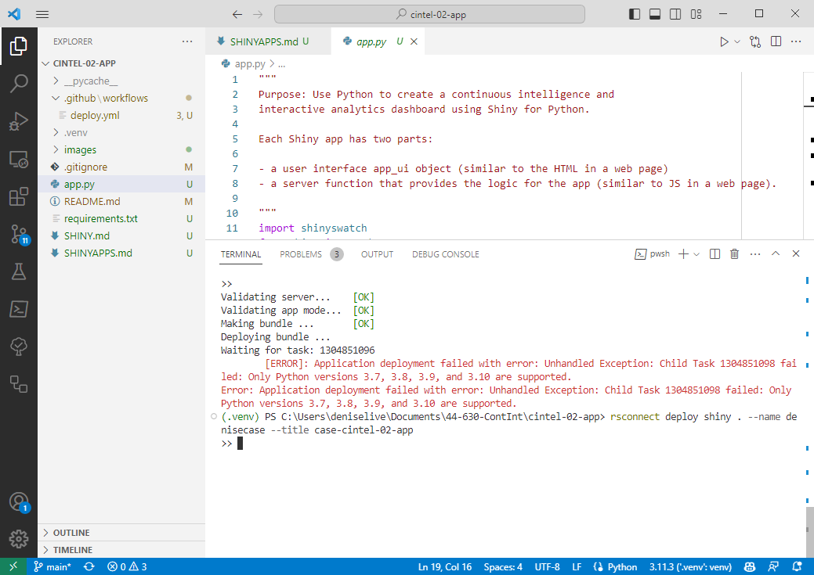
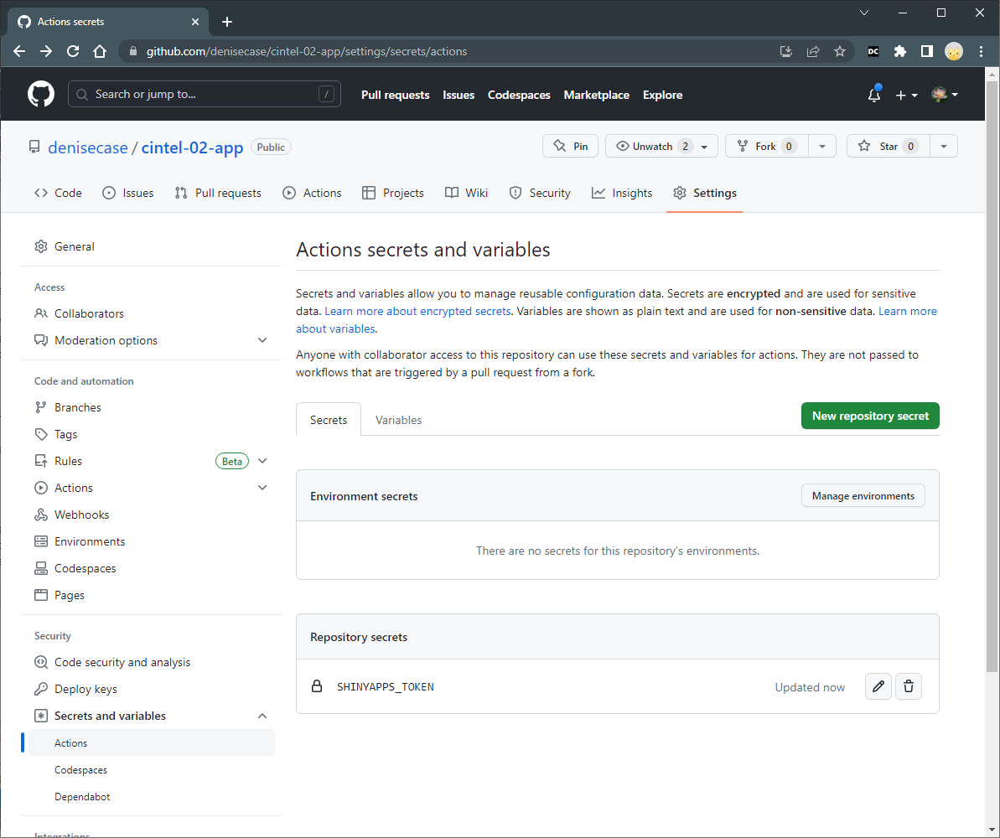
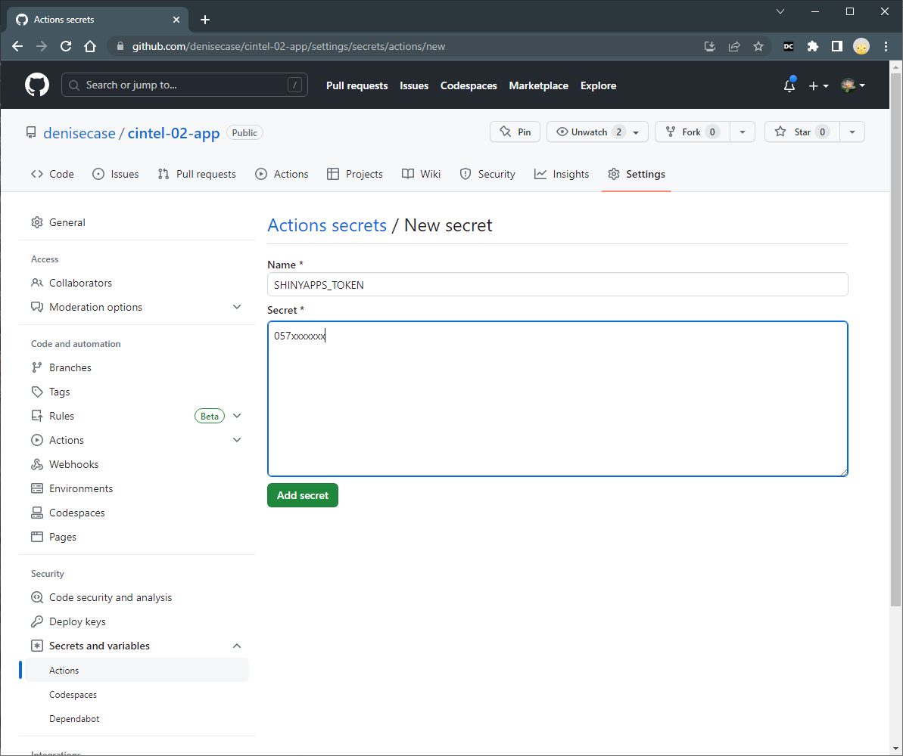
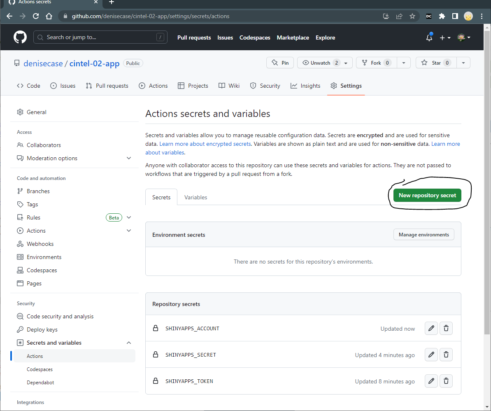

# Deploy a Shiny App to shinyapps.io

We'll deploy the app to [shinyapps.io](http://www.shinyapps.io/) by running a command in the VS Code Terminal.

- If an app is already running, that terminal window is busy and can't be used for additional commands. 
- In the VS Code Terminal, close/kill the terminal window running your local app. 
- Use Terminal / New Terminal to open a new Terminal window.  
- In the command below, the dot (.) means "this folder here / deploy the current folder".

TODO: Change this Markdown file to reflect your username instead of denisecase.

```shell
rsconnect deploy shiny . --name denisecase --title cintel-02-app
```

Since I run Python 3.11 on my machine and shinyapps.io only supports 3.10, I got the following error.

## Error Deploying to shinyapps.io (Python Version)




## Python Version Issues

Shinyapps.io currently supports Python 3.10 but not 3.11. 
I don't want to install 3.10 on my machine and it's already available on shinyapps.io, 
so I'm going to just configure my deployment to use 3.10. 
I'm not using any Python 3.11 features, so this should work fine.

I created a file named [.github/workflows/deploy.yml](.github/workflows/deploy.yml) to 
automatically deploy my app to shinyapps.io when I push changes to GitHub. 
In the file, I specify the Python version to use for deployment.

It's not hard, but I do have to configure some GitHub secrets to make it work.

## Set up shinyapps.io Secrets in GitHub

We have to get our secrets from shinyapps.io and add them to GitHub.

Login to [shinyapps.io](http://www.shinyapps.io/). Go to Account / Tokens.
You'll need three things:

- The Token
- The Secret (click Show / With Python tab / Show Secret)
- Your shinyapps.io account name (upper right by your profile)

Keep it open. We'll need to paste those values into GitHub.

Login to GitHub and go to your repository. 
On the right, click on Settings / Secrets and variables / Actions.
Use the green "New repository secret" button to add 3 secrets.



Name: SHINYAPPS_TOKEN
Secret:  (paste the token from shinyapps.io)

Name: SHINYAPPS_SECRET
Secret: (paste the secret from shinyapps.io)

Name: SHINYAPPS_ACCOUNT
Secret: Paste or type your shinyapps.io account name.



When you finish, your GitHub secrets should look like the following.



